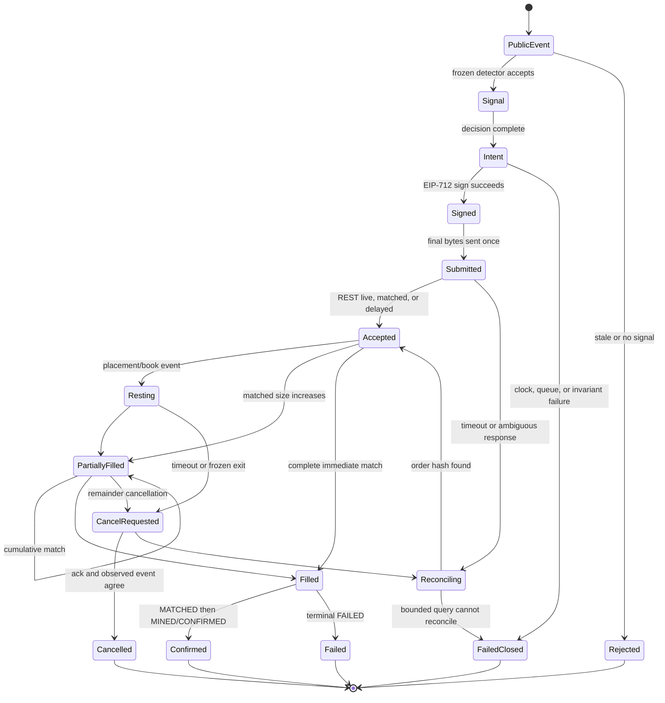

# Execution State Diagram

```mermaid
stateDiagram-v2
    [*] --> PublicEvent
    PublicEvent --> Signal: frozen detector accepts
    PublicEvent --> Rejected: stale or no signal
    Signal --> Intent: decision complete
    Intent --> Signed: EIP-712 sign succeeds
    Intent --> FailedClosed: clock, queue, or invariant failure
    Signed --> Submitted: final bytes sent once
    Submitted --> Accepted: REST live, matched, or delayed
    Submitted --> Reconciling: timeout or ambiguous response
    Reconciling --> Accepted: order hash found
    Reconciling --> FailedClosed: bounded query cannot reconcile
    Accepted --> Resting: placement/book event
    Accepted --> PartiallyFilled: matched size increases
    Accepted --> Filled: complete immediate match
    Resting --> PartiallyFilled
    PartiallyFilled --> PartiallyFilled: cumulative match
    PartiallyFilled --> Filled
    Resting --> CancelRequested: timeout or frozen exit
    PartiallyFilled --> CancelRequested: remainder cancellation
    CancelRequested --> Cancelled: ack and observed event agree
    CancelRequested --> Reconciling
    Filled --> Confirmed: MATCHED then MINED/CONFIRMED
    Filled --> Failed: terminal FAILED
    Cancelled --> [*]
    Confirmed --> [*]
    Failed --> [*]
    Rejected --> [*]
    FailedClosed --> [*]
```

`MATCHED` closes entry-latency measurement. `CONFIRMED` closes settlement
measurement. They must never be conflated.
