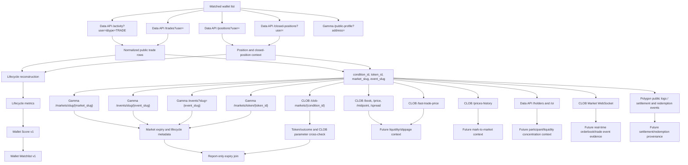

# Polymarket Public Endpoint Dependency Graph v1

Status: Discovery artifact  
Date: June 26, 2026  
Scope: Public read-only Polymarket data sources for Wallet Intelligence

This graph describes how public endpoints relate to the existing Wallet
Intelligence pipeline. It does not authorize integration, trading, wallet
connection, order placement, automatic trade copying, score changes, or broad
capture.

## Dependency Notes

- The existing normalized wallet trade rows already contain the best join
  keys: `condition_id`, `token_id`, `market_slug`, and `event_slug`.
- Gamma market/event endpoints are the best next dependency for expiry because
  they expose `endDate`, `startDate`, `closed`, `active`, event grouping, and
  resolution-source text without requiring private data.
- `GET /markets/slug/{slug}` is safer than `GET /markets?slug={slug}` for the
  next sprint because a bounded probe returned a historical fast market by
  path while the query route returned an empty array for the same slug.
- `GET /events/slug/{slug}` and `GET /events?slug={slug}` both returned the
  historical fast market event in the bounded probe; the implementation should
  preserve route provenance and compare returned event and market dates.
- CLOB `GET /clob-markets/{condition_id}` is the best CLOB cross-check for
  token and outcome mapping; it returned both historical and active/sampling
  market data in bounded probes.
- CLOB orderbook/price endpoints are useful for future liquidity or slippage
  work, but they should not be part of the expiry join sprint. They returned
  200 for a sampling market token and 404 for expired or non-orderbook tokens.
- CLOB `GET /prices-history` is useful for future mark-to-market work, but the
  probe found parameter sensitivity: `interval=max`, `interval=all`, and
  `interval=1h` returned data for a sampling token, while
  `interval=1m&fidelity=1` returned 400.
- Data API `/positions`, `/closed-positions`, `/holders`, `/oi`, `/value`, and
  `/traded` provide useful context, but they do not remove the dominant expiry
  ambiguity by themselves.
- Authenticated CLOB user/order endpoints, wallet/private-key flows, and user
  WebSocket channels remain excluded.

## Next Engineering Endpoint Set

Exactly these public read-only endpoints should be used by the next engineering
sprint:

1. `GET https://gamma-api.polymarket.com/markets/slug/{market_slug}`
2. `GET https://gamma-api.polymarket.com/events/slug/{event_slug}`
3. `GET https://gamma-api.polymarket.com/events?slug={event_slug}`
4. `GET https://gamma-api.polymarket.com/markets/token/{token_id}` as a
   fallback when slug joins fail.
5. `GET https://clob.polymarket.com/clob-markets/{condition_id}` as a
   token/outcome cross-check only.

